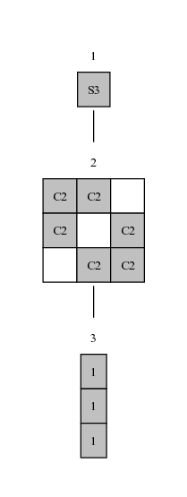

# Semigroups and monoids defined by generators

This section provides information about how to use the `Semigroups` package for
GAP to compute with a semigroup or monoid defined by a collection of
generators. We assume some basic familiarity with the GAP programming language,
see the [GAP: First Steps](session.md) section for a basic overview if you do
not yet feel comfortable with GAP.

All code examples in this section assume that the `Semigroups` package
is loaded. To do so, simply add
```gap
LoadPackage("Semigroups");
```
at the start of your gap script, or execute this command at the start of your
GAP session.

!!! failure "If Semigroups fails to load"
    If you encounter an error when loading the `Semigroups` package,
    it may be due to the kernel module (the `C++` component powering `Semigroups`)
    not being compiled. Execute the command
    `#!gap SetInfoLevel(InfoPackageLoading, 4);` and attempt to load the package
    again. If you see an error similar to the following:
    ```gap-repl
    gap> SetInfoLevel(InfoPackageLoading, 4);
    gap> LoadPackage("Semigroups");
    #I  Semigroups: entering LoadPackage 
    #I  Semigroups: PackageAvailabilityInfo for version 5.5.4
    #I  Semigroups: the kernel module is not compiled, 
    #I              the package cannot be loaded.
    #I  Semigroups: PackageAvailabilityInfo: the AvailabilityTest function returned false
    #I  Semigroups: PackageAvailabilityInfo: no installed version fits
    #I  Semigroups: return from LoadPackage, package is not available
    fail
    ```
    This is an indication that you need to compile the kernel module.
    Please follow [Step 7 of the Standard Install instructions](install.md#common-installation-steps)
    to fix this error.

## Kinds of elements

Any GAP object equipped with an associative multiplication can in principle
be used to construct a semigroup in GAP. However, there are certain kinds of
semigroups for which there exist the algorithms that are several orders
of magnitude faster than those applicable in the general case.
In particular, the `Semigroups` package implements efficient algorithms for
the so called
[_acting semigroups_](https://semigroups.github.io/Semigroups/doc/chap6_mj.html#X7A3AC74C7FF85825)[^1]
and has an efficient implementation of the
[Froidure-Pin algorithm](https://semigroups.github.io/Semigroups/doc/chap6_mj.html#X7E2DE9767D5D82F7)[^2]
which can be applied to subsemigroups of certain semigroups.

In this section we give a brief description of the main types of
elements which can be efficiently computed with via the `Semigroups` package.
See [Chapter 6](https://semigroups.github.io/Semigroups/doc/chap6_mj.html)
of the `Semigroups` package documentation for more details.

### Transformations

Recall that a _transformation_ of
degree $n$ is a function $f: \{1, \ldots, n\} \rightarrow \{1, \ldots, n\}$.
In GAP we can construct a transformation using the
[`Transformation`](https://docs.gap-system.org/doc/ref/chap53_mj.html#X86ADBDE57A20E323)
function.
One way of constructing a transformation $t$ is to provide
a list `A` such that the $i$-th entry `A[i]` is the image of the point $i$
under the transformation $t$. So, for example
`#!gap t := Transformation([1, 3, 3, 4]);` defines the transformation
`t \in \mathcal{T}_4`
such that $t(1) = 1, t(2) = t(3) = 3$ and $t(4) = 4$. We can
multiply transformations using the usual multiplication operator `*`.
Furthermore, we can obtain the image $t(x)$ of a point
$x \in \{1, \ldots, 4\}$ under $t$ via the power syntax `x ^ t`.

!!! note
    The code examples in this section will consist of two tabs: one labelled
    "GAP REPL" showcasing the output in an example GAP REPL session, and
    another labelled "GAP script" which contains the same code without the
    GAP REPL output, for easier copy-pasting into a GAP session.

=== "GAP REPL"
    ```gap-repl
    gap> a := Transformation([1, 3, 3, 4]);
    Transformation( [ 1, 3, 3 ] )
    gap> b := Transformation([2, 3, 4, 1]);
    Transformation( [ 2, 3, 4, 1 ] )
    gap> a * b;
    Transformation( [ 2, 4, 4, 1 ] )
    gap> b * a;
    Transformation( [ 3, 3, 4, 1 ] )
    gap> 2 ^ a;
    3
    gap> 3 ^ b;
    4
    gap> 2 ^ (a * b);
    4
    gap> 2 ^ (b * a);
    3
    ```
=== "GAP script"
    ```gap
    a := Transformation([1, 3, 3, 4]);
    b := Transformation([2, 3, 4, 1]);
    a * b;
    b * a;
    2 ^ a;
    3 ^ b;
    2 ^ (a * b);
    2 ^ (b * a);
    ```

As we discussed in the [Help system section](./session.md#the-help-system), to
learn more about any GAP function you can use the help operator `?` in the GAP
REPL, e.g.

```gap-repl
gap> ?Transformation
  53.2-1 Transformation
  
  ‣ Transformation( list ) ─────────────────────────────────────────── operation
  ‣ Transformation( list, func ) ───────────────────────────────────── operation
  ‣ TransformationList( list ) ─────────────────────────────────────── operation
  Returns:  A transformation.
  
  TransformationList returns the transformation f such that i ^ f = list[i] if i
  is  between  1  and  the  length of list and i ^ f = i if i is larger than the
  length  of  list.  An  error  will  occur in TransformationList if list is not
  dense, if list contains an element which is not a positive integer, or if list
  contains an integer not in [ 1 .. Length( list ) ].
  
  TransformationList  is  the  analogue  in  the  context  of transformations of
  PermList  (42.5-2). Transformation is a synonym of TransformationList when the
  argument is a list.
  
  When  the  arguments are a list of positive integers list and a function func,
  Transformation  returns  the  transformation  f  such that list[i] ^ f = func(
  list[i]  )  if i is in the range [ 1 .. Length( list ) ] and f fixes all other
  points.
  
  ─────────────────────────────────  Example  ──────────────────────────────────
    gap> SetUserPreference( "NotationForTransformations", "input" );
    gap> f := Transformation( [ 11, 10, 2, 11, 4, 4, 7, 6, 9, 10, 1, 11 ] );
    Transformation( [ 11, 10, 2, 11, 4, 4, 7, 6, 9, 10, 1, 11 ] )
    gap> f := TransformationList( [ 2, 3, 3, 1 ] );
    Transformation( [ 2, 3, 3, 1 ] )
    gap> SetUserPreference( "NotationForTransformations", "fr" );
    gap> f := Transformation( [ 10, 11 ], x -> x ^ 2 );
    <transformation: 1,2,3,4,5,6,7,8,9,100,121>
    gap> SetUserPreference( "NotationForTransformations", "input" );
  ──────────────────────────────────────────────────────────────────────────────
  
```

This can be especially helpful for understanding the functions we will use
going forward. In particular, the documentation shows us another way of
constructing a transformation using a list and a function.

Properties of transformations such as their _degree_, _image_, _kernel_ and
_rank_ are implemented by the
[`DegreeOfTransformation`](https://docs.gap-system.org/doc/ref/chap53_mj.html#X78A209C87CF0E32B),
[`ImageSetOfTransformation`](https://docs.gap-system.org/doc/ref/chap53_mj.html#X839A6D6082A21D1F),
[`KernelOfTransformation`](https://docs.gap-system.org/doc/ref/chap53_mj.html#X80FCB5048789CF75),
and [`RankOfTransformation`](https://docs.gap-system.org/doc/ref/chap53_mj.html#X818EBB167C7EA37B)
functions respectively.

=== "GAP REPL"
    ```gap-repl
    gap> c := Transformation([2, 3, 4, 1, 1]);
    Transformation( [ 2, 3, 4, 1, 1 ] )
    gap> DegreeOfTransformation(c);
    5
    gap> ImageSetOfTransformation(c);
    [ 1, 2, 3, 4 ]
    gap> KernelOfTransformation(c);
    [ [ 1 ], [ 2 ], [ 3 ], [ 4, 5 ] ]
    gap> RankOfTransformation(c);
    4
    ```
=== "GAP script"
    ```gap
    c := Transformation([2, 3, 4, 1, 1]);
    DegreeOfTransformation(c);
    ImageSetOfTransformation(c);
    KernelOfTransformation(c);
    RankOfTransformation(c);
    ```

!!! note
    Mathematically, all transformations in GAP belong to
    the infinite transformation monoid $\mathcal{T}_\mathbb{N}$ of transformations
    $f: \mathbb{N} \rightarrow \mathbb{N}$. GAP simply treats all points
    after the largest moved point of a transformation $t$ as fixed.
    This means that we can multiply two transformations acting
    on a different number of points, so e.g.
    `#!gap Transformation([2, 1]) * Transformation([3, 3, 4, 5]);`
    is valid. Similarly, `#!gap 10 ^ (Transformation([2, 1]));` is
    valid and returns `10`.
    The degree of a transformation $t$, as returned by
    the [`DegreeOfTransformation`](https://docs.gap-system.org/doc/ref/chap53_mj.html#X78A209C87CF0E32B)
    function in GAP, is simply the largest moved point of $t$, i.e.
    the largest value $n \in \mathbb{N}$ such that $t(n) \neq n$.

See [Chapter 53](https://docs.gap-system.org/doc/ref/chap53_mj.html) of the
GAP reference manual for more details about transformations.

!!! note
    GAP does not have a distinguished type for _partial transformations_
    of degree $n$,
    i.e. partial functions with domain and codomain in $\{1, \ldots, n\}$.
    However, for any fixed $n$, the semigroup of all partial transformations
    of degree $n$ is isomorphic to the semigroup of all total transformations
    of degree $n+1$, which is what the `Semigroups` package utilizes.
    See the documentation of the
    [`PartialTransformationMonoid`](https://semigroups.github.io/Semigroups/doc/chap7_mj.html#X808A27F87E5AC598)
    for more details.
    
### Partial permutations

Recall that a _partial permutation_ of degree $n$ is a partial function
$f: \{1, \ldots, n\} \rightarrow \{1, \ldots, n\}$ which is a bijection
when restricted to its _domain_, i.e. the set of points on which it is defined.
We can construct a partial permutation using the
[`PartialPerm`](https://docs.gap-system.org/doc/ref/chap54_mj.html#X8538BAE77F2FB2F8)
function in GAP by supplying two lists defining the domain and image of
the partial permutation. Partial permutations can be multiplied using `*`,
and the image of a point under a partial permutation can be obtained
using the `^` operator. Note that points not in the domain get mapped to `0`.

=== "GAP REPL"
    ```gap-repl
    gap> a := PartialPerm([1, 2, 5, 20], [2, 3, 5, 50]);
    [1,2,3][20,50](5)
    gap> b := PartialPerm([3, 4, 5, 6], [4, 3, 8, 7]);
    [5,8][6,7](3,4)
    gap> a * b;
    [2,4][5,8]
    gap> b * a;
    <empty partial perm>
    gap> 2 ^ a;
    3
    gap> 4 ^ a;
    0
    ```
=== "GAP script"
    ```gap
    a := PartialPerm([1, 2, 5, 20], [2, 3, 5, 50]);
    b := PartialPerm([3, 4, 5, 6], [4, 3, 8, 7]);
    a * b;
    b * a;
    2 ^ a;
    4 ^ a;
    ```

Partial permutations in GAP are displayed in _disjoint cycle and chain_
notation. Recall that a _cycle_ of a partial permutation $p$ is a sequence
of points $x_1, \ldots, x_k$ such that

* $x_1 \in \text{dom}(p)$,
* $p(x_i) = p(x_{i+1})$ for all $i \in \{1, \ldots, k - 1\}$ and
* $p(x_k) = x_1$.

A _chain_ of $p$
is a sequence of points $x_1, \ldots, x_k$ such that

* $x_1 \in \text{dom}(p) \setminus \text{im}(p)$,
* $p(x_i) = p(x_{i+1})$ for all $i \in \{1, \ldots, k - 1\}$ and
* $p(x_k) \in \text{im}(p)\setminus \text{dom}(p)$.

Just as permutations can be written in disjoint cycle notation, partial
permutations can be written in disjoint cycle and chain notation.
Cycles are displayed using round brackets `()` and chains using square
brackets `[]`.
See [Section 54.6](https://docs.gap-system.org/doc/ref/chap54_mj.html#X7849595B81D063EE)
of the reference manual for more details.

!!! warning
    A [`Set`](https://docs.gap-system.org/doc/ref/chap30_mj.html#X7E399AC97FD98217)
    in GAP is a strictly sorted list of elements. GAP expects the
    domain of `PartialPerm` to be a set, so in particular, this means
    that giving the elements of the domain of a `PartialPerm` out of
    order will result in a GAP error:

    ```gap-repl
    gap> PartialPerm([1, 2, 20, 5], [2, 3, 4, 50]); # 5 and 20 need to be swapped
    Error, usage: the 1st argument must be a set of positive integers and the 2nd
    argument must be a duplicate-free list of positive integers of equal length
    to the first
    *[1] ErrorNoReturn( "usage: the 1st argument must be a set of positive ", 
    "integers and the 2nd argument must be a duplicate-free ", 
    "list of positive integers of equal length to the first" );
    @ /Users/rcirpons/Desktop/Source/gap/lib/pperm.gi:527
    <function "PartialPerm">( <arguments> )
    called from read-eval loop at *stdin*:44
    type 'quit;' to quit to outer loop
    brk> 
    ```

    The image must not contain duplicates (as otherwise the element would not
    be a partial bijection), but otherwise there is no restriction on the
    order of elements.

Properties of transformations such as their
_degree_, _codegree_, _domain_, _image_, and _rank_ are implemented by the
[`DegreeOfPartialPerm`](https://docs.gap-system.org/doc/ref/chap54_mj.html#X8612A4DC864E7959),
[`CodegreeOfPartialPerm`](https://docs.gap-system.org/doc/ref/chap54_mj.html#X8413D0EF7DEE1FFF),
[`DomainOfPartialPerm`](https://docs.gap-system.org/doc/ref/chap54_mj.html#X784A14F787E041D7),
[`ImageSetOfPartialPerm`](https://docs.gap-system.org/doc/ref/chap54_mj.html#X7F0724A07A14DCF7) and
[`RankOfPartialPerm`](https://docs.gap-system.org/doc/ref/chap54_mj.html#X7C1ABD8A80E95B39)
functions respectively.

=== "GAP REPL"
    ```gap-repl
    gap> c := PartialPerm([1, 2, 5, 20, 22], [2, 3, 5, 50, 6]);
    [1,2,3][20,50][22,6](5)
    gap> DegreeOfPartialPerm(c);
    22
    gap> CodegreeOfPartialPerm(c);
    50
    gap> DomainOfPartialPerm(c);
    [ 1, 2, 5, 20, 22 ]
    gap> ImageSetOfPartialPerm(c);
    [ 2, 3, 5, 6, 50 ]
    gap> RankOfPartialPerm(c);
    5
    ```
=== "GAP script"
    ```gap
    c := PartialPerm([1, 2, 5, 20, 22], [2, 3, 5, 50, 6]);
    DegreeOfPartialPerm(c);
    CodegreeOfPartialPerm(c);
    DomainOfPartialPerm(c);
    ImageSetOfPartialPerm(c);
    RankOfPartialPerm(c);
    ```

!!! note
    Similar to transformations, all partial permutation in GAP belong to
    the infinite symmetric inverse monoid $\mathcal{I}_\mathbb{N}$ of
    partial bijections
    $f: \mathbb{N} \rightarrow \mathbb{N}$.

See [Chapter 54](https://docs.gap-system.org/doc/ref/chap54_mj.html#X7D6495F77B8A77BD)
of the GAP reference manual for more details.

### Bipartitions

### Partitioned binary relations

### Matrices over semirings

## Constructing semigroups

### Subsemigroups

### Multiplication tables

### Quotients

### Homomorphic images

## Analyzing semigroups

### Green's relations

### Egg-box diagrams


TODO: Integrate the below with the above

# Finite, finitely generated and acting semigroups in GAP

This section provides information about how to compute with a finite or finitely generated
semigroup or monoid using the `Semigroups` package for GAP. We assume some basic familiarity
with the GAP programming language, see the [GAP: First Steps](session.md) section for
a basic overview if you do not yet feel comfortable with GAP.

GAP does provide some built-in functionality related to semigroups, see the reference manual

* [Chapter 51: Semigroups and Monoid](https://docs.gap-system.org/doc/ref/chap51_mj.html),
* [Chapter 52: Finitely Presented Semigroups and Monoids](https://docs.gap-system.org/doc/ref/chap52_mj.html),
* [Chapter 53: Transformations](https://docs.gap-system.org/doc/ref/chap53_mj.html) and
* [Chapter 54: Partial permutations](https://docs.gap-system.org/doc/ref/chap54_mj.html).

However, some functionality is missing and many of the algorithms
for semigroups as implemented in base GAP can be quite slow. The `Semigroups` package
significantly expands the available computational semigroup theory toolbox and provides
fast `C++` implementations of standard semigroup theory algorithms, such as the
[Froidure-Pin algorithm](https://semigroups.github.io/Semigroups/doc/chap6_mj.html#X7E2DE9767D5D82F7).

In order to load the `Semigroups` package simply add
```gap
LoadPackage("Semigroups");
```
at the start of your gap script, or execute this command at the start of your
GAP session.


## Finite semigroups

In this section we showcase how one can construct and analyze certain kinds
of finite semigroups.

### Transformation semigroups

Before we delve into functions for analyzing semigroups, we first need to
construct some example to analyze. In this section we introduce one rich
family of examples, the _transformation semigroups_.

Recall that a _transformation_ of
degree $n$ is a function $f: \{1, \ldots, n\} \rightarrow \{1, \ldots, n\}$ and
the _full transformation semigroup_ of degree $n$ is semigroups
$\mathcal{T}_n$ consisting of all degree $n$ transformations under composition.

In GAP the function `#!gap FullTransformationSemigroup(n);` can be used to construct
the semigroup $\mathcal{T}_n$, and check some basic facts about it.

!!! note
    The code examples in this section will consist of two tabs: one labelled
    "GAP REPL" showcasing the output in an example GAP REPL session, and
    another labelled "GAP script" which contains the same code without the
    GAP REPL output, for easier copy-pasting into a GAP session.

=== "GAP REPL"
    ```gap-repl
    gap> T := FullTransformationSemigroup(3);
    <full transformation monoid of degree 3>
    gap> Size(T); # The order of T
    27
    gap> IsMonoid(T); # Is T a monoid?
    true
    gap> IsRegularSemigroup(T); # Is T regular?
    true
    gap> IsCommutativeSemigroup(T); # Is T commutative?
    false
    ```
=== "GAP script"
    ```gap
    T := FullTransformationSemigroup(3);
    Size(T); # The order of T
    IsMonoid(T); # Is T a monoid?
    IsRegularSemigroup(T); # Is T regular?
    IsCommutativeSemigroup(T); # Is T commutative?
    ```

As we discussed in the [Help system section](./session.md#the-help-system), to
learn more about any GAP function you can use the help operator `?` in the GAP
REPL, e.g.

```gap-repl
gap> ?FullTransformationSemigroup
  53.7-3 FullTransformationSemigroup
  
  ‣ FullTransformationSemigroup( n ) ─────────────────────────────────── function
  ‣ FullTransformationMonoid( n ) ────────────────────────────────────── function
  Returns:  The full transformation semigroup of degree n.
  
  If n is a positive integer, then FullTransformationSemigroup returns the monoid
  consisting  of  all  transformations  with  degree  at  most n, called the full
  transformation semigroup.
  
  The  full  transformation  semigroup  is  regular,  has  n ^ n elements, and is
  generated  by  any  set  containing transformations that generate the symmetric
  group on n points and any transformation of rank n - 1.
  
  FulTransformationMonoid is a synonym for FullTransformationSemigroup.
  
  ──────────────────────────────────  Example  ──────────────────────────────────
    gap> FullTransformationSemigroup( 1234 );
    <full transformation monoid of degree 1234>
  ───────────────────────────────────────────────────────────────────────────────
  -- <space> page, <n> next line, <b> back, <p> back line, <q> quit --
```

This can be especially helpful for understanding the functions we will use
going forward.

To display the elements of `T` we can use the GAP function `Elements`:

=== "GAP REPL"
    ```gap-repl
    gap> Elements(T);
    [ Transformation( [ 1, 1, 1 ] ), Transformation( [ 1, 1, 2 ] ), 
      Transformation( [ 1, 1 ] ), Transformation( [ 1, 2, 1 ] ), 
      Transformation( [ 1, 2, 2 ] ), IdentityTransformation, 
      Transformation( [ 1, 3, 1 ] ), Transformation( [ 1, 3, 2 ] ), 
      Transformation( [ 1, 3, 3 ] ), Transformation( [ 2, 1, 1 ] ), 
      Transformation( [ 2, 1, 2 ] ), Transformation( [ 2, 1 ] ), 
      Transformation( [ 2, 2, 1 ] ), Transformation( [ 2, 2, 2 ] ), 
      Transformation( [ 2, 2 ] ), Transformation( [ 2, 3, 1 ] ), 
      Transformation( [ 2, 3, 2 ] ), Transformation( [ 2, 3, 3 ] ), 
      Transformation( [ 3, 1, 1 ] ), Transformation( [ 3, 1, 2 ] ), 
      Transformation( [ 3, 1, 3 ] ), Transformation( [ 3, 2, 1 ] ), 
      Transformation( [ 3, 2, 2 ] ), Transformation( [ 3, 2, 3 ] ), 
      Transformation( [ 3, 3, 1 ] ), Transformation( [ 3, 3, 2 ] ), 
      Transformation( [ 3, 3, 3 ] ) ]
    ```
=== "GAP script"
    ```gap
    Elements(T);
    ```

Instead of representing transformations as functions, GAP uses a bespoke
`Transformation` object. A transformation $t$ is specified by providing
a list `A` such that the $i$-th entry `A[i]` is the image of the point $i$
under the transformation $t$. So, for example
`#!gap t := Transformation([1, 3, 3, 4]);` defines the transformation
`t \in \mathcal{T}_4`
such that $t(1) = 1, t(2) = t(3) = 3$ and $t(4) = 4$. We can
multiply transformations using the usual multiplication operator `*`.
Furthermore, we can obtain the image $t(x)$ of a point
$x \in \{1, \ldots, 4\}$ under $t$ via the power syntax `x ^ t`.

=== "GAP REPL"
    ```gap-repl
    gap> a := Transformation([1, 3, 3, 4]);
    Transformation( [ 1, 3, 3 ] )
    gap> b := Transformation([2, 3, 4, 1]);
    Transformation( [ 2, 3, 4, 1 ] )
    gap> a * b;
    Transformation( [ 2, 4, 4, 1 ] )
    gap> b * a;
    Transformation( [ 3, 3, 4, 1 ] )
    gap> 2 ^ a;
    3
    gap> 3 ^ b;
    4
    gap> 2 ^ (a * b);
    4
    gap> 2 ^ (b * a);
    3
    ```
=== "GAP script"
    ```gap
    a := Transformation([1, 3, 3, 4]);
    b := Transformation([2, 3, 4, 1]);
    a * b;
    b * a;
    2 ^ a;
    3 ^ b;
    2 ^ (a * b);
    2 ^ (b * a);
    ```

!!! note
    In fact, mathematically all transformations in GAP belong to
    the infinite transformation monoid $T_\mathbb{N}$ of transformations
    $f: \mathbb{N} \rightarrow \mathbb{N}$. GAP simply treats all points
    after the largest moved point of a transformation $t$ as fixed.
    This means that we can multiply two transformations acting
    on a different number of points, so e.g.
    `#!gap Transformation([2, 1]) * Transformation([3, 3, 4, 5]);`
    is valid. Similarly, `#!gap 10 ^ (Transformation([2, 1]));` is
    valid and returns `10`.

We can construct a semigroups generated by a set of transformations using the
`Semigroup` function:

=== "GAP REPL"
    ```gap-repl
    gap> a := Transformation([1, 3, 3, 4]);
    Transformation( [ 1, 3, 3 ] )
    gap> b := Transformation([2, 3, 4, 1]);
    Transformation( [ 2, 3, 4, 1 ] )
    gap> c := Transformation([1, 1, 2, 2]);
    Transformation( [ 1, 1, 2, 2 ] )
    gap> S := Semigroup([a, b, c]);
    <transformation semigroup of degree 4 with 3 generators>
    gap> Size(S); # All the usual semigroup functions should work
    128
    gap> IsRegularSemigroup(S);
    true
    gap> IsCommutativeSemigroup(S);
    false
    ```
=== "GAP script"
    ```gap
    a := Transformation([1, 3, 3, 4]);
    b := Transformation([2, 3, 4, 1]);
    c := Transformation([1, 1, 2, 2]);
    S := Semigroup([a, b, c]);
    Size(S); # All the usual semigroup functions should work
    IsRegularSemigroup(S);
    IsCommutativeSemigroup(S);
    ```


### Green's relations

TODO: Intro on what these are etc

<div class="grid" markdown>

  <div markdown>
  Recall that the _egg-box diagram_ of a semigroup is a visual representation
  of its Green's relations. In GAP we can display them using the `Splash` and
  `DotString` functions:

=== "GAP REPL"
    ```gap-repl
    gap> Splash(DotString(T, rec(maximal := true)));
    ```
=== "GAP script"
    ```gap
    Splash(DotString(T, rec(maximal := true)));
    ```

  The resulting egg-box diagram for $\mathcal{T}_3$ can be seen on the right.
  The large boxes labelled 1, 2 and 3 in the diagram correspond to Green's
  $\mathscr{D}$-classes of $\mathcal{T}_3$, the lines between them denote
  inclusion in the ordering on $\mathscr{D}$-classes induced by the Green's
  $\mathcal{J}$-relation.

  The rows of the boxes representing the $\mathscr{D}$-classes correspond to
  Green's $\mathscr{L}$-classes, the columns to Green's $\mathscr{R}$-classes.
  Finally, the cells of the boxes representing the $\mathscr{D}$-classes
  are the $\mathscr{H}$-classes of $\mathcal{T}_3$. Cells shaded in gray
  denote the group $\mathscr{H}$-classes, and they contain the [`StructureDescription`](https://docs.gap-system.org/doc/ref/chap39.html#X8199B74B84446971) of these groups.

  So, by visual inspection we can deduce that $\mathcal{T}_3$ has
  3 Green's $\mathscr{D}$-classes, furthermore, each $\mathscr{D}$-class
  contains a group $\mathscr{H}$-class, and is therefore a regular
  $\mathscr{D}$-class. Hence we can conclude that $\mathcal{T}_3$ is regular,
  just by visual inspection of the egg-box diagram.
  </div>

{ align=right width=200rem }
/// caption
The egg-box diagram of $\mathcal{T}_3$.
///
</div>

### Multiplication tables

!!! warning
    Multiplication tables are a very inefficient way of defining a
    semigroup. Indeed, to define a semigroup $S$ using a multiplication
    table we need to give a table of $|S|^2$ entries. However, if a
    generating set $A$ for $S$ is known, we can construct a transformation
    representation for $S$ by taking only those rows in the multiplication
    table that correspond to the generators in $A$. This allows us to
    construct a transformation semigroup $S^\prime$ that is isomorphic to
    $S$, and we only need specify $|A|\cdot |S|$ many entries.
    

### Cayley graphs

### Finite inverse semigroups

### Semigroups of bipartitions

[TODO](https://semigroups.github.io/Semigroups/doc/chap3_mj.html)

## Finitely generated semigroups

### Semigroups of matrices over semirings


[^1]:
    **East, J.**, **Egri-Nagy, A.**, **Mitchell, J. D.** and **Péresse, Y.**,
    _Computing finite semigroups_,
    J. Symbolic Computation, _92_ (2019), 110 - 155.
    DOI: [10.1016/j.jsc.2018.01.002](https://doi.org/10.1016/j.jsc.2018.01.002).

[^2]:
    **Froidure, V.** and **Pin, J.-E.**,
    _Algorithms for computing finite semigroups_,
    in _Foundations of computational mathematics (Rio de Janeiro, 1997)_,
    Springer, Berlin (1997), 112–126. 
    DOI: [10.1007/978-3-642-60539-0_9](https://doi.org/10.1007/978-3-642-60539-0_9)
