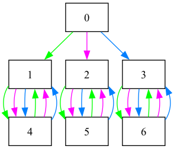

# Finitely presented semigroups and monoids

This section provides information about how to compute with a finitely
presented semigroup or monoid using `libsemigroups_pybind11`.

!!! warning

    Almost every question about finitely presented semigroups and monoids is
    undecidable in general. It is easy to find examples where the algorithms
    implemented in `libsemigroups_pybind11` will run forever, so some caution
    is required!

## Presentations

The algorithms in `libsemigroups_pybind11` for computing with finitely
presented semigroups and monoids all accept a `Presentation` object as (at
least part of the) input.

You can create a presentation using strings by doing:

```python
from libsemigroups_pybind11 import Presentation, presentation
p = Presentation("ab")  # a presentation with alphabet {a, b}
p.alphabet()            # returns "ab"
p.rules                 # returns the empty list
```

You can add rules to the presentation `p` one by one:

```python
presentation.add_rule(p, "aba", "bbba")     #  add aba = bbba
presentation.add_rule(p, "babba", "a" * 10)
p.rules # returns ['aba', 'bbba', 'babba', 'aaaaaaaaaa']
```

The relations (or rules) in the presentation are stored as a list
of strings, not a list of pairs of strings as you might expect.

If you make a mistake adding rules one by one, then you'll get an error:

```python
presentation.add_rule(p, "aba", "bbbc")
...
LibsemigroupsError: invalid letter 'c', valid letters are "ab"
```

Or you can define a presentation without giving the alphabet first:

```python
from libsemigroups_pybind11 import Presentation, presentation
# no alphabet, but will use lists of integers as words
p = Presentation(word=list[int])
p.rules = [[0, 1, 0], [1, 1, 1, 0], [1, 0, 1, 1, 0], [0] * 10]
p.alphabet_from_rules()
p.alphabet()  # returns [0, 1]
```

If you want a monoid presentation, then do:

```python
p.contains_empty_word(True)
```

In this case the empty string can be used in rules too.

```python
presentation.add_rule(p, [0, 1] * 100, [])
```

!!! note

    `libsemigroups_pybind11` can easily handle presentations with tens of millions of rules of total length into the hundreds of millions.

### Manipulating presentations

There are many functions in `libsemigroups_pybind11` for manipulating
presentations. In this section we will describe a couple of these. For more
details please consult the [Presentation helpers](https://libsemigroups.github.io/libsemigroups_pybind11/data-structures/presentations/present-helpers.html) page in the documentation.

There are a number of functions for defining rules of a particular type.
You can add rules indicating group inverses:

```python
from libsemigroups_pybind11 import Presentation, presentation
p = Presentation(word=str).alphabet("abAB")
p.contains_empty_word(True)
presentation.add_inverse_rules(p, "ABab")
p.rules # ['aA', '', 'bB', '', 'Aa', '', 'Bb', '']
```

In this example we have defined a (monoid) presentation with generator $\{a, b,
A, B\}$ and we are following the convention that $A$ is the inverse of $a$, and
$B$ is the inverse of $b$ and vice versa. The function
[presentation.add_inverse_rules](https://libsemigroups.github.io/libsemigroups_pybind11/data-structures/presentations/present-helpers.html#libsemigroups_pybind11.presentation.add_inverse_rules)
is helpful if you want to define a group by a monoid presentation.

You can change the alphabet of a presentation:

```python
from libsemigroups_pybind11 import Presentation, presentation
p = Presentation(word=str).alphabet("a")
p.contains_empty_word(True)
presentation.add_rule(p, "a" * 10, "")
presentation.change_alphabet(p, "x")
p.rules # ['xxxxxxxxxx', '']
```

You can remove trivial rules, remove duplicate rules, remove redundant
generators, replace a word with a new generator, sort the rules and many more:

```python
from libsemigroups_pybind11 import Presentation, presentation
p = Presentation(word=str).alphabet("ab")
p.contains_empty_word(True)
p.rules = ["a" * 10, "", "a" * 10, "", "aa", "aa", "b", "aa"]
presentation.remove_trivial_rules(p)
p.rules  # ['aaaaaaaaaa', '', 'aaaaaaaaaa', '', 'b', 'aa']
presentation.remove_duplicate_rules(p)
p.rules  # ['aaaaaaaaaa', '', 'b', 'aa']
presentation.remove_redundant_generators(p)
p.alphabet()  # returns "a"
p.rules   # returns ['aaaaaaaaaa', '']
presentation.replace_word_with_new_generator(p, "aaaa") # returns 'b'
p.rules   #  ['', 'bbaa', 'b', 'aaaa']
presentation.sort_each_rule(p)
p.rules   #  [bbaa', '', 'aaaa', 'b']
```

### Standard examples

You don't necessarily have to input your favourite semigroup presentation by
hand, there are 40+ standard examples already in `libsemigroups_pybind11`.
For example, for Iwahori and Iwahori's presentation for the full transformation
monoid of degree 7:

```python
from libsemigroups_pybind11.presentation import examples
examples.full_transformation_monoid_II74(7)
# returns <monoid presentation with 7 letters, 3,144 rules, and length 69,656>
```

See
[Presentations for standard examples](https://libsemigroups.github.io/libsemigroups_pybind11/data-structures/presentations/examples.html) for details.

## Finite or infinite?

You might want to know if a presentation defines a finite or an infinite
monoid or semigroup.

One place to start is using
[is_obviously_infinite](https://libsemigroups.github.io/libsemigroups_pybind11/data-structures/presentations/obvinf.htm://libsemigroups.github.io/libsemigroups_pybind11/data-structures/presentations/obvinf.html).
This function performs linear time (in the size of the input presentation)
checks that can sometimes tell you if a presentation defines an infinite
semigroup. Since it's linear time, this does not trigger any potentially
never ending algorithms.

```python
from libsemigroups_pybind11 import Presentation, is_obviously_infinite
p = Presentation("byr")
p.rules = ["byr", "b", "yrb", "y"]
is_obviously_infinite(p)  # returns True
p = Presentation("ab")
p.rules = ["a" * 10, "a", "b" * 7, "b" * 2]
is_obviously_infinite(p)  # returns True
p = Presentation("byr")
p.rules = ["byr", "b", "yrb", "y", "rby", "r"]
is_obviously_infinite(p)  # returns False
```

### Todd-Coxeter

The algorithm `libsemigroups_pybind11` implemented in the class
[ToddCoxeter](https://libsemigroups.github.io/libsemigroups_pybind11/main-algorithms/todd-coxeter/index.html)
can (sometimes!) show that a semigroup or monoid defined by a presentation is
finite, but it runs forever if the semigroup or monoid is infinite. So, it's a
bad idea to try to run the algorithm until it ends. Instead, functions like
`run_for` and `run_until` allow you to control how long the algorithm should run
for. A
[ToddCoxeter](https://libsemigroups.github.io/libsemigroups_pybind11/main-algorithms/todd-coxeter/index.html) object represents the congruence over a free semigroup or monoid generated by the relations in the input presentation.

```python
from libsemigroups_pybind11 import Presentation, congruence_kind, ToddCoxeter
from datetime import timedelta
p = Presentation("byr").contains_empty_word(True)
p.rules = ["byr", "b", "yrb", "y", "rby", "r"]
tc = ToddCoxeter(congruence_kind.twosided, p)
# tc.number_of_classes() # BAD IDEA, might run forever!
tc.run_for(timedelta(seconds=1)) # GOOD IDEA, run for 1 second
tc.finished()  # returns True, so we know p defined a finite monoid
tc.number_of_classes() # returns 7
```

A picture of the right Cayley graph can be produced from `tc` in the example
above by doing:

```python
from libsemigroups_pybind11 import word_graph
word_graph.dot(tc.word_graph()).view()
```

which produces:

<figure markdown="span">
	
</figure>

!!! tip

    If you know that a presentation defines a finite semigroup or monoid and it
    is not too big, then Todd-Coxeter will usually run faster than the other
    algorithms described below.

### Knuth-Bendix

The algorithm in `libsemigroups_pybind11` implemented in the class
[KnuthBendix](https://libsemigroups.github.io/libsemigroups_pybind11/main-algorithms/knuth-bendix/index.html)
can (sometimes!) show that a semigroup or monoid defined by a presentation is
finite or infinite. It's also a bad idea to try to run the algorithm until it
ends, since it can sometimes be slow, or run forever.
[KnuthBendix](https://libsemigroups.github.io/libsemigroups_pybind11/main-algorithms/knuth-bendix/index.html) objects also represent congruences.

```python
from libsemigroups_pybind11 import Presentation, congruence_kind, KnuthBendix
from datetime import timedelta
p = Presentation("byr").contains_empty_word(True)
p.rules = ["byr", "b", "yrb", "y", "rby", "r"]
kb = KnuthBendix(congruence_kind.twosided, p)
# kb.number_of_classes() # BAD IDEA, might run forever!
kb.run_for(timedelta(seconds=1)) # GOOD IDEA, run for 1 second
kb.finished()  # returns True, so we know p defined a finite monoid
kb.number_of_classes() # returns 7
list(kb.active_rules())
# returns
# [('by', 'bb'),
#  ('rr', 'rb'),
#  ('rbb', 'r'),
#  ('bbb', 'b'),
#  ('br', 'bb'),
#  ('yy', 'yb'),
#  ('ry', 'rb'),
#  ('ybb', 'y'),
#  ('yr', 'yb')]
```

Here's a large finite example where Todd-Coxeter would take a long time:

```python
from libsemigroups_pybind11 import KnuthBendix, congruence_kind
from libsemigroups_pybind11.presentation import examples
p = examples.symmetric_group_Moo97_a(12)
kb = KnuthBendix(congruence_kind.twosided, p)
kb.number_of_classes() # returns math.factorial(12) == 479_001_600
```

Here's an infinite example.

```python
from libsemigroups_pybind11 import Presentation, presentation, congruence_kind, KnuthBendix
from datetime import timedelta
p = Presentation("BCA")
presentation.add_rule(p, "AABC", "ACBA")
kb = KnuthBendix(congruence_kind.twosided, p)
kb.number_of_classes()  # returns +∞
```

### Run everything at the same time

If you want to run some variants of Knuth-Bendix, Todd-Coxeter, and some
further algorithms, such as determining the small overlap class of a finitely
presented semigroup or monoid, then you can use a
[Congruence](https://libsemigroups.github.io/libsemigroups_pybind11/main-algorithms/congruence/index.html) to do
this. This class lacks the fine-grained control available in [KnuthBendix](https://libsemigroups.github.io/libsemigroups_pybind11/main-algorithms/knuth-bendix/index.html) and [ToddCoxeter](https://libsemigroups.github.io/libsemigroups_pybind11/main-algorithms/todd-coxeter/index.html), but is sometimes more convenient.

```python
from libsemigroups_pybind11 import Congruence, congruence_kind
from libsemigroups_pybind11.presentation import examples
p = examples.symmetric_group_Moo97_a(12)
c = Congruence(congruence_kind.onesided, p)
c.number_of_classes() # returns math.factorial(12) == 479_001_600
```

### Non-isomorphism

In this section we show how to demonstrate that two monoids defined by
presentations are not isomorphic.

```python
from libsemigroups_pybind11 import congruence_kind, ToddCoxeter
from libsemigroups_pybind11.presentation import examples
p = examples.symmetric_inverse_monoid_Shu60(4)
tc = ToddCoxeter(congruence_kind.twosided, p)
tc.number_of_classes() # returns 209
```

Let's check if the monoid defined by all but the last relation `[[0, 3, 0, 3,
0], [0, 3, 0, 3]]` in the presentation `p` defines the symmetric inverse monoid
on 4 points also. One way of doing this is to just remove the relation, and
check if the presentation defines a monoid of the same size. This sometimes
works, and it does here:

```python
from libsemigroups_pybind11 import congruence_kind, ToddCoxeter
from libsemigroups_pybind11.presentation import examples
p = examples.symmetric_inverse_monoid_Shu60(4)
p.rules = p.rules[:-2]
tc = ToddCoxeter(congruence_kind.twosided, p)
tc.number_of_classes() # returns 384
```

so the last relation is not redundant!

Let's try again with the second to last relation `[2, 3, 2, 0],
 [0, 2, 3, 2]`

```python
from libsemigroups_pybind11 import congruence_kind, ToddCoxeter
from libsemigroups_pybind11.presentation import examples
p = examples.symmetric_inverse_monoid_Shu60(4)
p.rules = p.rules[:-4] + p.rules[-2:]
tc = ToddCoxeter(congruence_kind.twosided, p)
tc.number_of_classes() # returns 209
```

So the second to last relation is redundant. Let's try again with the relation
`[3, 0, 3, 0], [0, 3, 0, 3]` which is `p.rules[18], p.rules[19]`:

```python
from libsemigroups_pybind11 import congruence_kind, ToddCoxeter
from libsemigroups_pybind11.presentation import examples
p = examples.symmetric_inverse_monoid_Shu60(4)
p.rules = p.rules[:18] + p.rules[20:]
tc = ToddCoxeter(congruence_kind.twosided, p)
tc.number_of_classes() # returns +∞
```

So `[3, 0, 3, 0], [0, 3, 0, 3]` is also not redundant. Let's try again with the
first rule `[0, 0], []`.

```python
from libsemigroups_pybind11 import congruence_kind, ToddCoxeter
from libsemigroups_pybind11.presentation import examples
from datetime import timedelta
p = examples.symmetric_inverse_monoid_Shu60(4)
p.rules = p.rules[2:]
tc = ToddCoxeter(congruence_kind.twosided, p)
tc.run_for(timedelta(seconds=4))
tc.finished()  # False
tc.number_of_nodes_active()  # returns 2330320 on my computer
```

So this is inconclusive. Maybe it's infinite and Todd-Coxeter can't answer this
question for us, so let's try Knuth-Bendix:

```python
from libsemigroups_pybind11 import congruence_kind, KnuthBendix
from libsemigroups_pybind11.presentation import examples
from datetime import timedelta
p = examples.symmetric_inverse_monoid_Shu60(4)
p.rules = p.rules[2:]
kb = KnuthBendix(congruence_kind.twosided, p)
kb.run_for(timedelta(seconds=4))
kb.finished()  # False
kb.number_of_active_rules()  # returns 14699 on my computer
```

So this is inconclusive too, what do? The [low-index congruence
algorithm](https://pubs.ams.org/journals/mcom/0000-000-00/S0025-5718-2025-04136-X)
(similar to Sims' low index subgroup algorithm) can compute the numbers of
left/right, and 2-sided congruences on a finitely presented semigroup,
regardless of whether or not the semigroup is finite. This algorithm is
implemented in the
[Sims1](https://libsemigroups.github.io/libsemigroups_pybind11/main-algorithms/low-index/classes/sims1.html)
class. The following computes the number of right congruences with up to 5
classes on the monoid defined by the presentation `p`:

```python
from libsemigroups_pybind11 import Sims1
from libsemigroups_pybind11.presentation import examples
from datetime import timedelta
p = examples.symmetric_inverse_monoid_Shu60(4)
S = Sims1(p)
S.number_of_congruences(5) # returns 18
p.rules = p.rules[2:]
S.presentation(p)
S.number_of_congruences(5) # returns 26
```

This says that the symmetric inverse monoid has 18 right congruences with up to
5 classes, but the monoid defined by the presentation with the first relation
removed `p.rules[2:]` has 26 such congruences. So, these monoids are not
isomorphic.
