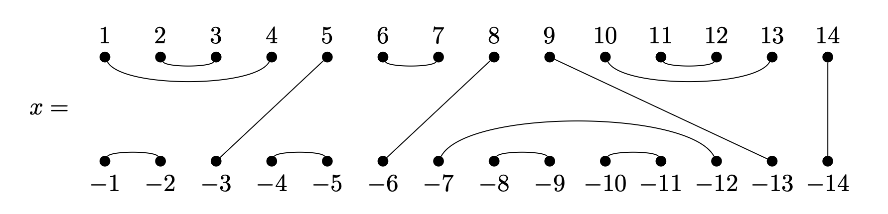

# Worksheet

This page contains some exercises for computing some things using `libsemigroups_pybind11`.


2. Recall that the commuting graph of a semigroup  $S$ is the graph with nodes
   the elements of $S$ and an edge $(x, y)$ if $xy = yx$ holds. Let
   $\mathcal{T}_n$ be the full transformation monoid on $n \leq 5$ points. Show
   that the clique numbers of the commuting graph of $\mathcal{T}_n$ are $2 ^ {n - 1}$.

    ??? hint

        You can define $\mathcal{T}_n$ as a finitely presented monoid in
        `libsemigroups_pybind11` by doing:

        ```python
        from libsemigroups_pybind11.presentation import examples
        examples.full_transformation_monoid(n)
        ```

        You can also define the generating set and the corresponding monoid with:

        ```python
        from libsemigroups_pybind11 import Transf
        def full_transf_monoid_generators(n: int) -> list[Transf]:
            if n == 1:
                return [Transf([0])]
            elif n == 2:
                return [Transf([1, 0]), Transf([0, 0])]

            return [
                Transf(list(range(1, n)) + [0]),
                Transf([1, 0] + list(range(2, n))),
                Transf(list(range(n - 1)) + [0]),
            ]
        ```

    ??? hint 
        
        You might want to use a python package for graphs to compute the clique
        numbers; see for example [igraph](https://python.igraph.org/en/stable/).

3. Let $S$ be the semigroup defined by the presentation
    $$
      \langle a, b, c, d, e, f, g \mid abcd = a^3ea^2, ef= dg\rangle.
    $$

    1. Show that $S$ is infinite.
    
    2. Partition the first $1000$ elements of the free semigroup $\{a, b, c, d,
       e, f, g\}^+$ so that words belong to the same part if and only if they
       represent the same element of $S$.

    ??? hint 

        See [StringRange](https://libsemigroups.github.io/libsemigroups_pybind11/data-structures/words/string-range.html) and [congruence.partition](https://libsemigroups.github.io/libsemigroups_pybind11/main-algorithms/congruence/helpers.html#libsemigroups_pybind11.congruence.partition)

4. Is the monoid defined by the presentation
    $$
      \langle x_2, \ldots, x_n\mid x_i^2 = (x_ix_j) ^3 =
      (x_ix_jx_k)^4 = 1\quad i, j, k \text{ distinct}\rangle
    $$
    the symmetric group for $n\geq 2$?

    ??? hint

        [Non-isomorphism](fp.md#non-isomorphism)
      
5. Determine which of the relations in the presentation are redundant and which
  are not:
    $$
      \langle a, b \mid a^4=1,  b^2= b, ba^3ba= a^2(ab)^2,  (ba^2)^2= (a^2b)^2 ,  (ba)^2a^2= aba^3b, a(ab)^4= (ab)^4 \rangle.
    $$
   What is the minimal set of the relations in this presentation that
   define the same monoid?

6. Let $S$ be the Catalan monoid of degree $3$.
   <!-- TODO check which parts of this are actually doable-->

    2. Draw the left and right Cayley graphs of $S$.
    3. Show that $S$ has two non-trivial non-universal non-Rees congruences.
    4. Show that the lattice of left and right congruences of $S$ are isomorphic.

1. Let $J_n$ denote the Jones monoid of degree $n$, and

    

    be a bipartition of degree 14.

    1. How many elements does $J_{14}$ contain?
    2. How many idempotent elements does $J_{14}$ contain?
    3. How many idempotent elements does the Green's
       $\mathscr{D}$-class of $x$ in $J_{14}$ contain?
    4. How many idempotent elements $e$ such that $7$ is in the same part as 
       a negative integer does the Green's $\mathscr{D}$-class of $x$ in $J_{14}$ contain?

    ??? hint

        You can define $J_{14}$ as a finitely presented monoid in `libsemigroups_pybind11` by doing:

        ```python
        from libsemigroups_pybind11.presentation import examples
        examples.temperley_lieb_monoid(14)
        ```

        You could answer parts (a), and (b) using this presentation. 
        
        You can also define the generating set and the corresponding monoid with:

        ```python
        from libsemigroups_pybind11 import Bipartition, FroidurePin


        def jones_identity(n):
            if n < 0:
                raise ValueError("the argument (an int) is not >= 0")

            return Bipartition([[i, -i] for i in range(1, n + 1)])


        def jones_generators(n):
            if n < 0:
                raise ValueError("the argument (an int) is not >= 0")

            gens = []
            for i in range(1, n):
                part = [[i, i + 1], [-i, -i - 1]]
                part.extend([j, -j] for j in range(1, i))
                part.extend([j, -j] for j in range(i + 2, n + 1))
                gens.append(Bipartition(part))
            return gens


        def jones_monoid(n):
            return FroidurePin([jones_identity(n)] + jones_generators(n))
        ```
    <!--
    9. Matrix(IsTropicalMaxPlusMatrix, [[0, -infinity], [-infinity, 0]], 1), Matrix(IsTropicalMaxPlusMatrix, [[-infinity, 0], [-infinity, -infinity]], 1), Matrix(IsTropicalMaxPlusMatrix, [[-infinity, 0], [0, -infinity]], 1),
      Matrix(IsTropicalMaxPlusMatrix, [[-infinity, 0], [0, 0]], 1), Matrix(IsTropicalMaxPlusMatrix, [[-infinity, 1], [0, -infinity]], 1), Matrix(IsTropicalMaxPlusMatrix, [[-infinity, 0], [0, 1]], 1),
      Matrix(IsTropicalMaxPlusMatrix, [[0, 1], [1, 0]], 1) ]

        1. Show that the monoid $M$ generated by these matrices has size 81.

        2. Find a transformation representation on fewer than $81$ points.

        3. Show that there's no homomorphism from $M$ to the Catalan monoid of degree $5$.
    -->
    
